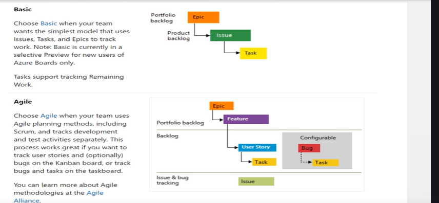

**In Azure DevOps (ADO), a *process* defines how work items are structured and managed, while a *process template* is a predefined configuration that includes work item types, workflows, and rules tailored to specific project methodologies like Agile, Scrum, or CMMI.**

---

### 🧩 What Is a Process in Azure DevOps?
- A **process** governs the behavior of work items in a project.
- It defines:
  - Work item types (e.g., Bug, Task, User Story)
  - States and transitions (e.g., New → Active → Closed)
  - Rules and field layouts
- You choose a process when creating a new project, and it determines how your team tracks work.

---

### 📦 What Is a Process Template?
- A **process template** is a packaged set of configurations used to create a process.
- It includes:
  - Work item definitions
  - Form layouts
  - Workflow states
  - Security settings
- Templates are used in **on-premises Azure DevOps Server** and can be customized or imported.

---

### 🗂️ Default Process Templates and Their Work Items

| **Process Template** | **Work Item Types** | **Best For** |
|----------------------|---------------------|--------------|
| **Agile**            | Epic, Feature, User Story, Task, Bug | Teams using Agile methodology |
| **Scrum**            | Epic, Feature, Product Backlog Item (PBI), Task, Bug | Scrum teams with sprints and backlogs |
| **Basic**            | Issue, Epic, Feature | Lightweight tracking for small teams |
| **CMMI**             | Requirement, Change Request, Task, Bug, Review, Risk | Enterprises with formal processes |

Sources: [Microsoft Learn – Default Processes](https://learn.microsoft.com/en-us/azure/devops/boards/work-items/guidance/choose-process?view=azure-devops)

---

### 🧠 How Work Items Differ by Process
- **Agile** uses *User Stories* to capture functionality from the user's perspective.
- **Scrum** replaces User Stories with *PBIs* and emphasizes sprint planning.
- **Basic** simplifies tracking with just *Epics*, *Features*, and *Issues*.
- **CMMI** adds formal items like *Change Requests* and *Risks* for compliance-heavy environments.

---

### 🛠️ Customizing Processes
- In Azure DevOps Services (cloud), you can create **inherited processes** to customize fields, rules, and layouts.
- In Azure DevOps Server (on-prem), you modify **process templates** directly using XML files.

